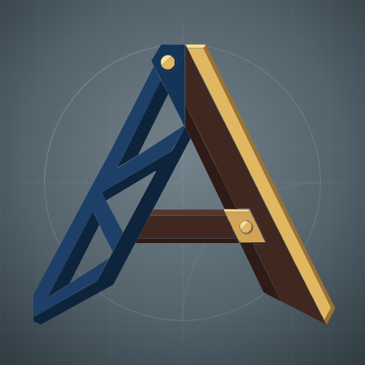

<p align="center">
  
</p>

# Axiomata

Axiomata provides the foundation for complex objects that players build and interact with directly
in the world, beyond the usual item, block and single-hitbox entity systems. It currently includes:

- A data-driven blueprint system with drawing quality and staged, in-world construction
- Model-based geometry used for collision, interaction, moving surfaces, climbing and pathfinding
- Projectile flight and aiming, penetration, block damage, debris and artillery particles
- Timed loading stages for players and automated crews

## For mod developers

Blueprint integrations use `UnderConstruction`. Model collision integrations use
`CollidableStructure`. Their supporting APIs are under `me.mss1r.axiomata.blueprint.api` and
`me.mss1r.axiomata.collision`.

Artillery integrations extend `BallisticProjectile` and provide their own projectile catalog and
`ImpactResolver`. Block-damage policy and player attribution stay with the consuming mod.
Loading uses `LoadingController.Host` and `LoadingRequirement`; each weapon supplies its stages,
timings, sounds and completion callbacks. These APIs are under `me.mss1r.axiomata.ballistics`,
`me.mss1r.axiomata.data.profile` and `me.mss1r.axiomata.loading`.

Call `DebrisPhysics.register()` during mod startup so saved debris can find your block-damage policy.
Entities with projectile openings implement `ProjectilePassThroughControl`; Axiomata installs
the impact handler. Custom `ParticleSet`s need smoke sprite definitions and client providers;
the flash core is registered and supplied by Axiomata.

Add fixed-count components to the item tag `axiomata:quality_cost_exempt` to keep their blueprint
cost independent of drawing quality. A material specified by a tag is exempt only when all its
items are exempt. Material tags use `tag.item.<namespace>.<path>` translations (`/` becomes `.`);
without a translation, the build menu shows the tag ID.

### Gradle

```gradle
repositories {
    maven { url 'https://jitpack.io' }
    maven { url 'https://maven.architectury.dev/' }
}

dependencies {
    implementation "com.github.mess1re.axiomata:${minecraftVersion}-${loader}:${axiomataVersion}"
}
```

`minecraftVersion` and `loader` select the matching build; `axiomataVersion` is the release tag.
ForgeGradle projects should pass the coordinate through `fg.deobf(...)`.

## Building

Run `./gradlew build` (`gradlew.bat build` on Windows). Version-specific jars are written to
`versions/<target>/build/libs`.

## Blockbench tool

The construction-section plugin and its installation instructions are in
[`tools/blockbench`](tools/blockbench).

## Contributing

See [`CONTRIBUTING.md`](CONTRIBUTING.md).

## License

Source code, build scripts and non-artistic data are licensed under
[LGPL-3.0-only](LICENSE). Original artistic assets are covered by
[`LICENSE-ASSETS.md`](LICENSE-ASSETS.md).
